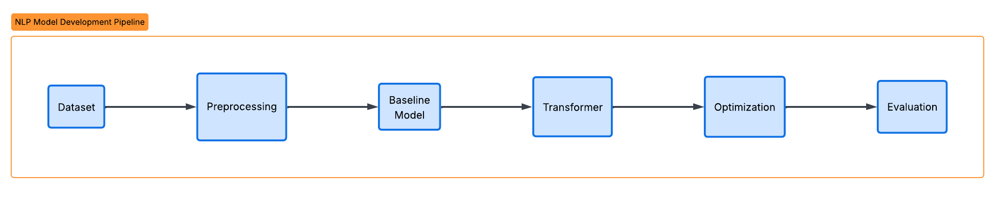
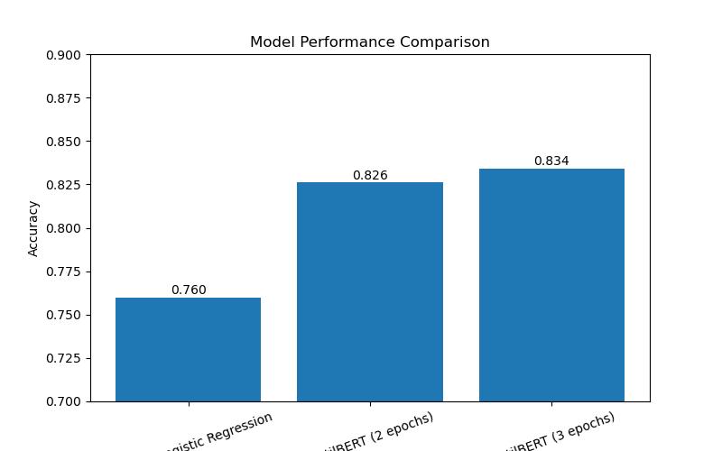

# Customer Review Sentiment Analysis with NLP

This project implements a complete sentiment analysis pipeline for Amazon customer reviews using Natural Language Processing (NLP) and deep learning techniques.

The goal of the project is to automatically classify customer reviews into three sentiment categories:

- Negative
- Neutral
- Positive

The project compares a traditional machine learning approach with a modern transformer-based model to evaluate improvements in sentiment classification performance.

## Project structure
```bash
project-root
│
├── notebooks
│ ├── 01_initial_inspection.ipynb
│ ├── 02_data_preparation.ipynb
│ ├── 03_baseline_model.ipynb
│ ├── 04_transformer_model.ipynb
│ ├── 05_transformer_optimization.ipynb
│ ├── 06_evaluation_comparison.ipynb
│ ├── 07_demo_sentiment_prediction.ipynb
│
├── models
│ ├── distilbert_3class_balanced_v1
│ ├── distilbert_3class_v2_optimized
│
├── images
│ ├── Confusion_matrix_transformer_model.png
│ ├── pDistribution_of_reviews.png
│ ├── Original_rating_Distribution.png
│ ├── Workflow_diagram.png
│ ├── project_pipeline.png
│ ├── Model_Performance_Comparison.png
│
├── data
│ ├── test.csv
│ ├── train.csv.zip
│
├── requirements.txt
│
└── README.md
```
The project was implemented entirely using **Jupyter Notebooks**, which document each stage of the machine learning pipeline.

## Project Overview

Customer reviews provide valuable insights for companies, but manually analyzing thousands of reviews is inefficient.  
Sentiment analysis allows automated classification of textual feedback to understand customer satisfaction and product perception.  

This project builds a full NLP pipeline consisting of:

1. Data inspection and exploratory analysis
2. Data preprocessing and class balancing
3. Baseline machine learning model
4. Transformer-based deep learning model
5. Model evaluation and comparison
6. Iterative optimization of the transformer model
7. Live sentiment prediction demo


## Dataset

The project uses an Amazon customer reviews dataset containing **568,454 product reviews**.  
[Data Set](https://www.kaggle.com/datasets/arhamrumi/amazon-product-reviews)

The dataset includes:

- Review text
- Star rating (1–5)

The ratings are converted into three sentiment categories:

| Rating | Sentiment |
|------|------|
| 1–2 | Negative |
| 3 | Neutral |
| 4–5 | Positive |

To avoid class imbalance during training, the dataset was balanced to include **42,640 samples per class**.
Total training dataset size used in modeling: **127,920 reviews**

## Project Pipeline

The following data processing pipeline was implemented:

  

## Models Implemented

### Baseline Model

TF-IDF vectorization with Logistic Regression.

Purpose:

- Establish a performance baseline
- Compare classical NLP methods with deep learning

Accuracy achieved:

**76%**
  

### Transformer Model

A fine-tuned **DistilBERT transformer model** was used for sentiment classification.  
DistilBERT is a lightweight version of BERT that provides strong language understanding while requiring fewer computational resources.  
  
Advantages:

- Contextual word embeddings
- Better handling of negation
- Improved understanding of sentence structure
- Better performance on complex reviews

Training configuration:

- Batch size: 16
- Sequence length: 128 tokens
- Learning rate: 2e-5
- Epochs: 2
- GPU acceleration (NVIDIA GTX 1650)

Accuracy achieved:  
 
**82.6%**  

## Iterative Optimization

An optimization experiment was performed to evaluate the impact of longer training.  

Optimization applied:

- Increased training epochs from **2 → 3**

Result:

Accuracy improved from:

**82.67% → 83.43%**

This demonstrates the impact of iterative model tuning during the development phase.

## Model Performance Comparison

| Model | Accuracy |
|------|------|
| TF-IDF + Logistic Regression | 0.76 |
| DistilBERT (2 epochs) | 0.826 |
| DistilBERT Optimized (3 epochs) | 0.834 |

The transformer model significantly outperformed the classical NLP approach due to its ability to capture contextual relationships between words.  



## Example Prediction

The trained transformer model can classify new customer reviews.

### Example 1:

```
Input Review:
"I enjoy my coffee machine and it makes awesome coffee"

Model Prediction:
Sentiment → Positive
Confidence → 0.988
```

### Example 2 (Negation):

```
Input Review:
"The product quality is not good and I would not recommend it."

Model Prediction:
Sentiment → Negative
Confidence → 0.975
```
This demonstates negation handling in the model.  

Users can test their own reviews using:
notebooks/07_demo_sentiment_prediction.ipynb


## Technical Challenge

During development, a GPU configuration issue occurred.

PyTorch was initially installed without CUDA support, resulting in the error:

```
Torch not compiled with CUDA enabled
```

The issue was resolved by reinstalling the CUDA-enabled PyTorch version (cu118) and verifying GPU availability using:

```
torch.cuda.is_available()
```

This enabled GPU acceleration for transformer training.
  
  
## Trained Models:
Trained transformer models are not included in the repository due to file size limitations.

Models can be reproduced by running:

notebooks/04_transformer_model.ipynb
and
notebooks/05_transformer_optimization.ipynb

## Libraries Used

Python libraries used in this project:

- pandas
- scikit-learn
- PyTorch
- HuggingFace Transformers
- HuggingFace Datasets
- Matplotlib
- Seaborn
  
## Author
Jaco Venter

BSc Data Science 
International University of Applied Science (Germany)

[LinkedIn Profile](https://www.linkedin.com/in/jaco-venter-45502a162/)
